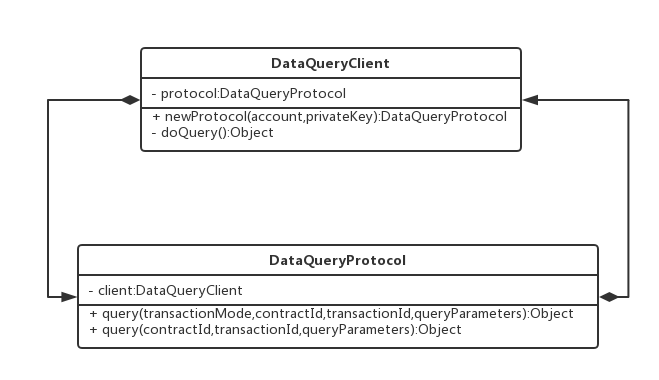

# 数据使用方SDK 接入文档

## 引言

数据使用方 SDK 是一个数据服务客户端。

## SDK 实现结构



> 类型 DataQueryClient

``` d
定义数据查询的实现方式。过程如下：

1，创建一个新的 DataQueryClient 类型实例
2，创建 DataQueryClient 对象的数据查询协议 DataQueryProtocol 类型的实例
3，基于 DataQueryProtocol 的内容执行查询
```

> 类型 DataQueryProtocol

``` d
定义一次查询所需要的相关配置内容。详细内容如下：

    /**
     * 设置合约 uri 访问地址
     * @param contractUri 合约 uri 地址
     * @return 返回当前协议
     */
    public DataQueryProtocol setContractUri(String contractUri)

    /**
     * 设置自定义交易订单仓库
     * @param transactionRepository 交易订单仓库
     * @return 返回当前协议对象
     */
    public DataQueryProtocol setTransactionRepository(TransactionRepository transactionRepository)

    /**
     * 设置自定义合约处理器
     * @param dataContractHandler 合约处理器
     * @return 返回当前协议对象
     */
    public DataQueryProtocol setDataContractHandler(DataContractHandler dataContractHandler)

    /**
     * 设置自定义交易订单 id 生成器
     * @param transactionIdentityBuilder 一个交易订单 id 生成器
     * @return 返回当前协议对象
     */
    public DataQueryProtocol setTransactionIdentityBuilder(
            TransactionIdentityBuilder transactionIdentityBuilder)

    /**
     * 设置 http[s] 连接超时时间
     * @param timeoutHttpConnect 超时时间
     * @return 返回当前协议对象
     */
    public DataQueryProtocol setTimeoutHttpConnect(int timeoutHttpConnect)

    /**
     * 设置 http[s] 流数据读取超时时间
     * @param timeoutHttpRead 超时时间，单位毫秒
     * @return 返回当前协议对象
     */
    public DataQueryProtocol setTimeoutHttpRead(int timeoutHttpRead)

    /**
     * 设置 http[s] 内容编码方式
     * @param httpEncoding 内容编码方式名称
     * @return 返回当前协议对象
     */
    public DataQueryProtocol setHttpEncoding(String httpEncoding)

    /**
     * 设置自定义日志
     * @param logger 日志处理器
     * @return 返回当前协议对象
     */
    public DataQueryProtocol setLogger(Logger logger)

    /**
     * 设置混淆数据数量
     * @param obfuscateSize 混淆数据数量
     * @return 返回当前协议对象
     */
    public DataQueryProtocol setObfuscateSize(int obfuscateSize)

    /**
     * 设置混淆数据字段明恒
     * @param obfuscateField 混淆数据字段名称
     * @return 返回当前协议对象
     */
    @Deprecated
    public DataQueryProtocol setObfuscateField(String obfuscateField)

    /**
     * 设置数据混淆器
     * @param dataObfuscator 一个数据混淆器
     * @return 返回当前协议对象
     */
    public DataQueryProtocol setDataObfuscator(DataObfuscator dataObfuscator)

    /**
     * 设置基于时间的交易有效天数，或者基于次数的有效交易次数
     * @param transactionTicks 基于时间的交易有效天数，或者基于次数的有效交易次数
     * @return 返回当前协议对象
     */
    public DataQueryProtocol setTransactionTicks(int transactionTicks)

    /**
     * 设置最小预处理交易数量
     * @param minPreviousTransactionSize 最小预处理交易数量
     * @return 返回当前协议独享
     */
    public DataQueryProtocol setMinPreviousTransactionSize(int minPreviousTransactionSize)

    /**
     * 启用匿踪查询
     * @param anonymousKeys 一组匿踪查询的 key
     * @return 返回当前协议对象
     */
    public DataQueryProtocol enableAnonymousQuery(String... anonymousKeys)

    /**
     * 禁用匿踪查询
     * @return 返回当前协议对象
     */
    public DataQueryProtocol disableAnonymousQuery()

    /**
     * 设置一组匿踪查询的 key
     * @param anonymousKeys 一组匿踪查询的 key
     * @return 返回当前协议对象
     */
    private DataQueryProtocol setAnonymousKeys(String... anonymousKeys)

    /**
     * 启用数据提供方过滤器
     * @param filterPredicate 数据提供方过滤条件
     * @return 返回当前协议对象
     */
    public DataQueryProtocol enableDataProducerFilter(Predicate<DataProducer> filterPredicate)

    /**
     * 禁用数据提供方过滤器
     * @return 返回当前协议对象
     */
    public DataQueryProtocol disableDataProducerFilter()
```

## 如何使用 SDK

``` java

/**
 * @author baimao
 * @create 2018/8/22
 */
public class DataQueryClientTest {

    private static final String charset = "utf-8";
    // eos 账户名称
    private static final String account = "zx.test1";
    // eos 账户私钥
    private static final String privateKey = "5KAzMoo9ABgwfURJ3ihLaysPUCWN3CDLCP7ZYjVFPHg7hSfy6gG";
    // eos 访问地址
    private static final String contractUri = "http://preview.unitedata.link/v1";
    // 合约地址
    private static final String contractId = "dd1yraw5vlfw";
    // 交易 id
    private static final String transactionId = "";
    // 交易模型
    private static final TransactionMode mode = TransactionMode.packageTime;
    // 查询参数
    private static final Map<String, Object> queryParameters
            = new HashMap<>();
    // 数据提供方筛选器
    private static final Predicate<DataProducer> producerFilter = null;

    @Test
    public void QueryTest(){

        try {
            final Object data =
                    DataQueryClient.newProtocol(account, privateKey)
                    // [必填] 设置 eos 访问地址
                    .setContractUri(contractUri)
                    // [可选] 设置 http[s] 文本编码器，默认 utf-8
                    .setHttpEncoding(charset)
                    // [可选] 设置 预处理订单数量，默认 2
                    .setMinPreviousTransactionSize(2)
                    // [可选] 设置 当前批次交易的次数，或者有效天数，默认 1
                    .setTransactionTicks(30)
                    // 基于默认的按次计费的模式的交易订单的查询方式，交易订单可选
//                    .query(contractId, transactionId, queryParameters)
                    // 基于指定交易模式的交易订单的查询方式，交易订单可选
                    .query(mode, contractId, transactionId, queryParameters)
                    // 基于指定交易模式，以及主动筛选数据提供方的交易订单的查询方式，交易订单可选
//                  .query(mode, contractId, transactionId, queryParameters, producerFilter)
            ;
            System.out.println("[data]    --> "+ data);
        }
        catch (Exception cause){
            cause.printStackTrace();
        }
    }
}
```

## 数据使用方-数据服务 api

数据服务 api 是基于 http[s] 协议的一个数据客户端服务。它进一步封装了数据服务 SDK，并且提供了一组 restful API 风格的简单接口。部署过程请查看[部署文档](consumer-api-install-doc.md)
