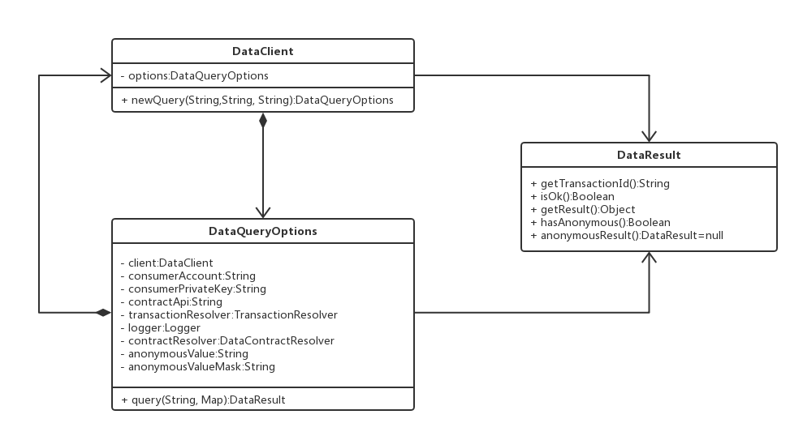

# 数据使用方SDK 接入文档

## 引言

数据使用方 SDK 是一个数据服务客户端。

## SDK 实现结构



如上图所示，SDK 主要是围绕以上三个类型展开：

类型 DataClient 声明了数据客户端的基本功能。DataClient 使用配置上下文中的描述信息来实现数据处理的业务功能。

类型 DataQueryOptions 声明了数据处理业务功能所需要的所有相关配置信息，它需要依赖 DataClient 类型，并通过 DataClient 类型的实例来得到实例。每一个 DataQueryOptions 类型的实例都对应唯一一个 DataClient 的实例。通过 DataQueryOptions 类型的实例，调用函数 query 来实现数据查询的业务功能。

接口 DataResult 描述了数据处理结果的上下文结构，调用方通过这个类型的实例函数来获取相关的信息。

## 如何使用 SDK

``` java
<dependency>
    <groupId>org.unitedata</groupId>
    <artifactId>ud-data-consumer-sdk</artifactId>
    <version>1.0.0-SNAPSHOT</version>
</dependency>

/**
 * @author baimao
 * @create 2018/8/22
 */
public class DataQueryClientTest {

    private static final String charset = "utf-8";
    // eos 账户名称
    private static final String account = "";
    // eos 账户私钥
    private static final String privateKey = "";
    // eos 访问地址
    private static final String contractUri = "http://preview.unitedata.link/v1";
    // 交易订单本地仓库，用来在本地保存交易订单的仓库
    private static final TransactionRepository localTransactionRepository
            = new LocalTransactionRepository();
    // 自定义日志组件
    private static final Logger customLogger
            = new CustomLogger();
    // 合约地址
    private static final String contractId = "合约地址";
    // 交易 id
    private static final String transactionId = "交易 id";
    // 交易模型
    private static final TransactionMode mode = TransactionMode.packageTicks;
    // 查询参数
    private static final Map<String, Object> queryParameters
            = new HashMap<>();
    // 数据提供方筛选器
    private static final Predicate<DataProducer> producerFilter = null;

    @Test
    public void QueryTest(){

        DataQueryClient.newProtocol(account, privateKey)
                // [必填] 设置 eos 访问地址
                .setContractUri(contractUri)
                // [可选] 设置 日志组件
                .setLogger(customLogger)
                // [可选] 设置 http[s] 文本编码器，默认 utf-8
                .setHttpEncoding(charset)
                // [可选] 设置 预处理订单数量，默认 2
                .setMinPreviousTransactionSize(2)
                // [可选] 设置 交易订单本地仓库，默认 null
                .setTransactionRepository(localTransactionRepository)
                // [可选] 设置 当前批次交易的次数，或者有效天数，默认 1
                .setTransactionTicks(1)
                // 基于默认的按次计费的模式的交易订单的查询方式，交易订单可选
//                .query(contractId, transactionId, queryParameters)
                // 基于指定交易模式的交易订单的查询方式，交易订单可选
//                .query(mode, contractId, transactionId, queryParameters)
                // 基于指定交易模式，以及主动筛选数据提供方的交易订单的查询方式，交易订单可选
                .query(mode, contractId, transactionId, queryParameters, producerFilter);
    }

    /**
     * 自定义日志组件
     */
    private static final class CustomLogger implements Logger{

        private static final org.slf4j.Logger log = LoggerFactory.getLogger(CustomLogger.class);

        @Override
        public void info(String message) {
            log.info(message);
        }

        @Override
        public void warn(String message) {
            log.warn(message);
        }

        @Override
        public void debug(String message) {
            log.debug(message);
        }

        @Override
        public void error(String message) {
            log.error(message);
        }

        @Override
        public void error(Throwable cause) {
            log.error(cause.getMessage(), cause);
        }
    }

    /**
     * 交易订单本地仓库，用来在本地保存交易订单的仓库
     * @author baimao
     */
    private static final class LocalTransactionRepository implements TransactionRepository{

        @Override
        public void putTransaction(DataProducer producer,
                                   Transaction transaction, DataQueryProtocol protocol) {

        }

        @Override
        public void putContract(DataContract contract) {

        }

        @Override
        public DataContract fetchContract(String contractId,
                                          DataQueryProtocol protocol) {
            return null;
        }

        @Override
        public Transaction fetchOne(String contractId,
                                    String transactionId, DataQueryProtocol protocol) {
            return null;
        }

        @Override
        public Transaction fetchProducerAvailableTransaction(DataProducer producer,
                                                             DataContract contract,
                                                             DataQueryProtocol protocol) {
            return null;
        }

        @Override
        public int countProducerAvailableTransaction(DataProducer producer,
                                                     DataContract contract, DataQueryProtocol protocol) {
            return 0;
        }
    }
}
```

## 数据使用方-数据服务 api

数据服务 api 是基于 http[s] 协议的一个数据客户端服务。它进一步封装了数据服务 SDK，并且提供了一组 restful API 风格的简单接口。部署过程请查看[部署文档](consumer-api-install-doc.md)
